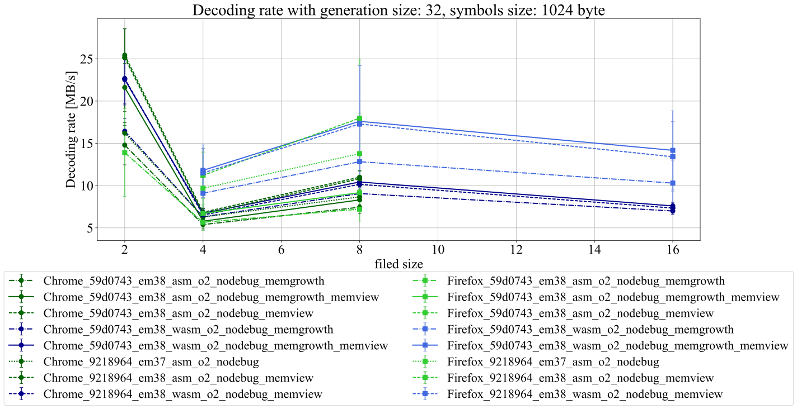
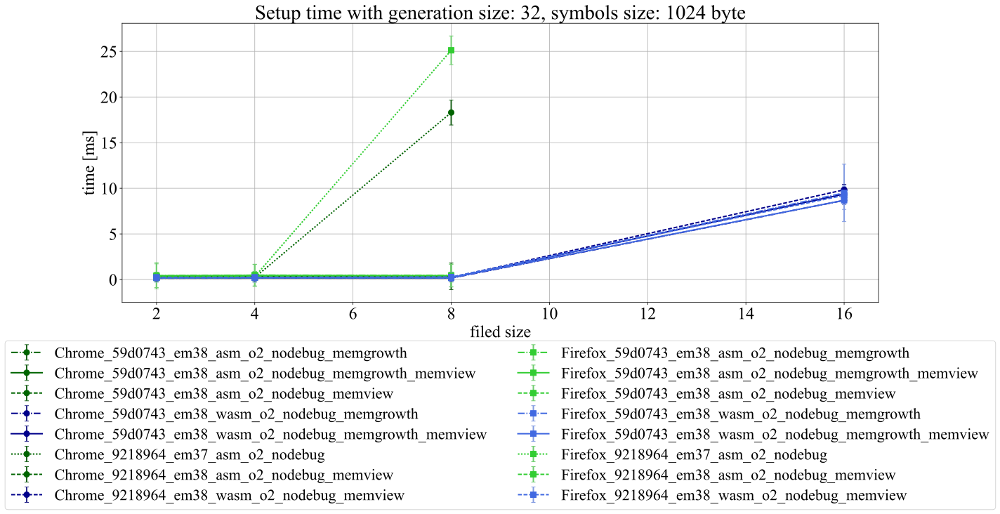
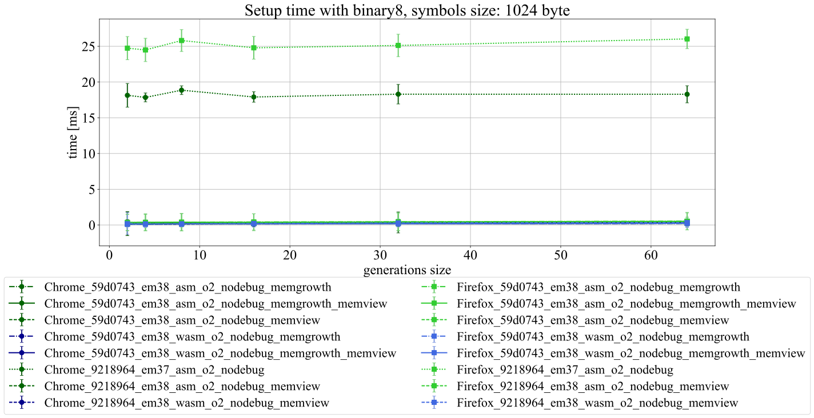
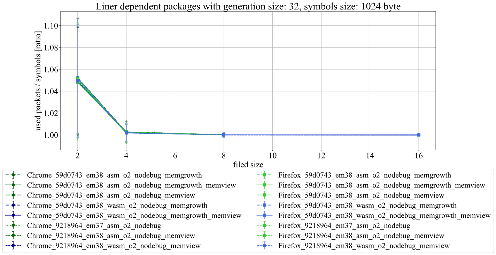

# Results

We used [kodo-js commit: 59d0743](https://github.com/steinwurf/kodo-js/tree/59d07433990963bd6c2acba96d95a14cff4e00f1) with emscripten v1.38.10 to obtain these results.
We also had an older kodo commit:9218964 version built with emscripten v1.37.37.

See all results in the `plots/` folder.

1) We used a combination following flags for build `-O2`, `--cxx_nodebug`,  `-s ALLOW_MEMORY_GROWTH=1` and `-s WASM=0`.
`WASM` flag switches between asm.js and WebAssembly compilation method.
2) We tested the gain of using memory view by altering the official kodo-js source for the encoded data: 

```C++
template<class Coder>
emscripten::val coder_write_payload(Coder& coder)
{	
   std::vector<uint8_t> payload(coder.payload_size());
   uint32_t length = coder.write_payload(payload.data());    
   
   emscripten::val heap = emscripten::val::module_property("buffer");
   emscripten::val payload_view = emscripten::val::global("Uint8Array").new_( heap, reinterpret_cast<uintptr_t>(payload.data()), length);
   return payload_view.call<emscripten::val>("slice");
}

```

## Environment
Win 10. x62  
i7-6700HQ @ 2.60Ghz  
16GB ram  
Chrome v68.0.3440.106 (64 bit)  
Firefox v61.0.3 (64bit)  


## Setup
All measurement run for 1000 times and and average is calculated.
For some lib setup combination data is missing. We had issues with the compiled lib, sometimes we got decoding errors.
Only those results are included in our plots that we could 1000 times reproduce.

## Analysis

### Decoding rate
Firefox performs significantly better with WebAssembly, but WebAssembly is generally performs better than asm.js




### Encoding rate
For encoding the difference is not that obvious, but the memory view with WebAssembly helps:


### Setup time

Setup time is mostly constant for filed size binary, binary4 and binary8, but for binary16 it increases significantly.

Furthermore the setup time about the half when using WebAssembly instead of asm.js. 

The high standard deviation occurs because the first few coder creation requires significantly more time than the rest.

### Linearly dependent packets

This metric only depends on the used field and generation, not on the used compilation method.
There is a higher chance of generating linearly dependent packets, with lower generation and field size:



## Verdict

WebAssembly seems to be a good choice, while using memory view can further improve the performance.
The results (or the lack of data) also show that using `binary16` had the most errors.
An interesting outcome is that our older `kodo` built performs reasonably well in terms of coding speed, but the setup time is significantly longer.
Further investigation is required to see if its the results of the new `kodo` or the new `emscripten`.
